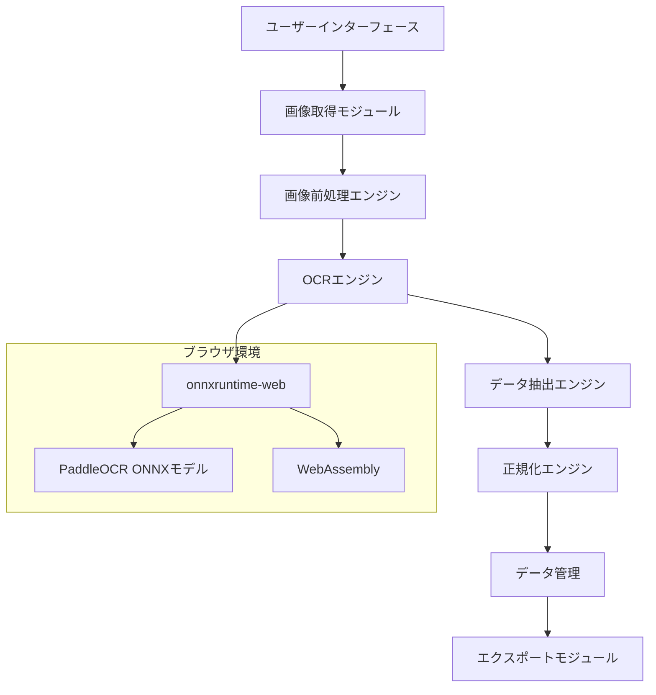

# 設計ドキュメント

## 概要

日本の領収書OCR Webアプリケーションは、完全にクライアントサイドで動作するシングルページアプリケーション（SPA）として設計されます。PaddleOCRのONNXモデルとonnxruntime-webを使用して、ブラウザ内でリアルタイムOCR処理を実行し、領収書から構造化データを抽出します。

## アーキテクチャ

### システム全体構成



### レイヤー構成

1. **プレゼンテーション層**: React/Vue.jsベースのUI
2. **ビジネスロジック層**: OCR処理、データ抽出、正規化
3. **データアクセス層**: ローカルストレージ、IndexedDB
4. **推論層**: onnxruntime-web + PaddleOCR ONNX

## コンポーネントとインターフェース

### 1. 画像取得モジュール (ImageCaptureModule)

**責任**: カメラ撮影、ファイル選択、画像前処理

```typescript
interface ImageCaptureModule {
  captureFromCamera(): Promise<ImageData>
  selectFromFile(): Promise<ImageData>
  applyEXIFCorrection(image: ImageData): ImageData
  estimatePerspectiveCorrection(image: ImageData): PerspectiveParams
  applyPerspectiveCorrection(image: ImageData, params: PerspectiveParams): ImageData
}

interface PerspectiveParams {
  corners: Point[]
  transformMatrix: number[][]
}
```### 
2. OCRエンジン (OCREngine)

**責任**: PaddleOCR ONNXモデルを使用したテキスト検出・認識

```typescript
interface OCREngine {
  initialize(): Promise<void>
  detectText(image: ImageData): Promise<TextDetection[]>
  recognizeText(image: ImageData, regions: TextDetection[]): Promise<TextRecognition[]>
  processFullImage(image: ImageData): Promise<OCRResult[]>
  processRegion(image: ImageData, region: Rectangle): Promise<OCRResult[]>
}

interface TextDetection {
  bbox: Rectangle
  confidence: number
}

interface TextRecognition {
  text: string
  confidence: number
  bbox: Rectangle
}

interface OCRResult {
  text: string
  confidence: number
  bbox: Rectangle
  candidates: string[]
}
```

### 3. データ抽出エンジン (DataExtractionEngine)

**責任**: OCR結果から構造化データの抽出

```typescript
interface DataExtractionEngine {
  extractReceiptData(ocrResults: OCRResult[]): ReceiptData
  extractDate(ocrResults: OCRResult[]): FieldResult
  extractPayee(ocrResults: OCRResult[]): FieldResult
  extractAmount(ocrResults: OCRResult[]): FieldResult
  extractUsage(ocrResults: OCRResult[]): FieldResult
}

interface FieldResult {
  value: string
  confidence: number
  candidates: string[]
  bbox?: Rectangle
}

interface ReceiptData {
  date: FieldResult
  payee: FieldResult
  amount: FieldResult
  usage: FieldResult
  metadata: {
    processedAt: Date
    imageHash: string
  }
}
```

### 4. 正規化エンジン (NormalizationEngine)

**責任**: 抽出されたデータの正規化と検証

```typescript
interface NormalizationEngine {
  normalizeDate(dateString: string): string
  normalizeAmount(amountString: string): number
  normalizePayee(payeeString: string): string
  normalizeUsage(usageString: string): string
}
```

### 5. UIコンポーネント

**主要コンポーネント**:
- `CameraCapture`: カメラ撮影UI
- `ImagePreview`: 画像表示・編集UI
- `RegionSelector`: 矩形選択UI
- `ReceiptForm`: データ入力・編集フォーム
- `ExportPanel`: エクスポート機能UI## データ
モデル

### 領収書データモデル

```typescript
interface Receipt {
  id: string
  imageData: ImageData
  extractedData: ReceiptData
  processingHistory: ProcessingStep[]
  createdAt: Date
  updatedAt: Date
}

interface ProcessingStep {
  type: 'auto_ocr' | 'manual_region' | 'user_edit'
  timestamp: Date
  field?: string
  oldValue?: string
  newValue?: string
  confidence?: number
}
```

### 設定データモデル

```typescript
interface AppConfig {
  ocrSettings: {
    confidenceThreshold: number
    detectionModel: string
    recognitionModel: string
  }
  uiSettings: {
    language: 'ja' | 'en'
    theme: 'light' | 'dark'
  }
  exportSettings: {
    defaultFormat: 'json' | 'csv'
    includeMetadata: boolean
  }
}
```

## エラーハンドリング

### エラー分類

1. **システムエラー**: モデル読み込み失敗、メモリ不足
2. **入力エラー**: 不正な画像形式、サポートされていないファイル
3. **処理エラー**: OCR失敗、抽出失敗
4. **ユーザーエラー**: 無効な入力、操作エラー

### エラーハンドリング戦略

```typescript
interface ErrorHandler {
  handleSystemError(error: SystemError): void
  handleInputError(error: InputError): void
  handleProcessingError(error: ProcessingError): void
  handleUserError(error: UserError): void
}

class ErrorRecovery {
  retryOCR(image: ImageData, maxRetries: number): Promise<OCRResult[]>
  fallbackToManualInput(field: string): void
  suggestImageImprovement(error: ProcessingError): string[]
}
```## 
テスト戦略

### 1. 単体テスト
- 各モジュールの独立したテスト
- モック使用によるONNXモデルのテスト
- データ正規化ロジックのテスト

### 2. 統合テスト
- OCRエンジンとデータ抽出の統合テスト
- UI コンポーネント間の連携テスト
- エンドツーエンドのワークフローテスト

### 3. パフォーマンステスト
- 大きな画像ファイルの処理時間測定
- メモリ使用量の監視
- モバイルデバイスでの動作確認

### 4. ユーザビリティテスト
- 実際の領収書画像を使用したテスト
- 異なるデバイス・ブラウザでの動作確認
- アクセシビリティ要件の検証

## 技術実装詳細

### PaddleOCR ONNX統合

```typescript
class PaddleOCREngine implements OCREngine {
  private detectionSession: InferenceSession
  private recognitionSession: InferenceSession
  
  async initialize(): Promise<void> {
    // 検出モデルの読み込み
    this.detectionSession = await InferenceSession.create('/models/det_model.onnx')
    
    // 認識モデルの読み込み
    this.recognitionSession = await InferenceSession.create('/models/rec_model.onnx')
  }
  
  async detectText(image: ImageData): Promise<TextDetection[]> {
    const tensor = this.preprocessImageForDetection(image)
    const results = await this.detectionSession.run({ input: tensor })
    return this.postprocessDetectionResults(results)
  }
  
  async recognizeText(image: ImageData, regions: TextDetection[]): Promise<TextRecognition[]> {
    const recognitions: TextRecognition[] = []
    
    for (const region of regions) {
      const croppedImage = this.cropImageRegion(image, region.bbox)
      const tensor = this.preprocessImageForRecognition(croppedImage)
      const result = await this.recognitionSession.run({ input: tensor })
      const text = this.postprocessRecognitionResult(result)
      
      recognitions.push({
        text,
        confidence: region.confidence,
        bbox: region.bbox
      })
    }
    
    return recognitions
  }
}
```###
 データ抽出アルゴリズム

```typescript
class ReceiptDataExtractor implements DataExtractionEngine {
  extractDate(ocrResults: OCRResult[]): FieldResult {
    const datePatterns = [
      /(\d{4})[\/\-年](\d{1,2})[\/\-月](\d{1,2})[日]?/,
      /(令和|平成|昭和|大正)(\d{1,2})年(\d{1,2})月(\d{1,2})日/,
      /(\d{1,2})[\/\-](\d{1,2})[\/\-](\d{4})/
    ]
    
    for (const result of ocrResults) {
      for (const pattern of datePatterns) {
        const match = result.text.match(pattern)
        if (match) {
          return {
            value: this.normalizeDate(match[0]),
            confidence: result.confidence,
            candidates: [match[0]],
            bbox: result.bbox
          }
        }
      }
    }
    
    return { value: '', confidence: 0, candidates: [] }
  }
  
  extractAmount(ocrResults: OCRResult[]): FieldResult {
    const amountPatterns = [
      /¥?(\d{1,3}(?:,\d{3})*)/,
      /(\d+)円/,
      /金額[：:]?\s*¥?(\d{1,3}(?:,\d{3})*)/
    ]
    
    const priorityKeywords = ['合計', '税込', 'お会計', '計']
    let bestMatch: FieldResult = { value: '', confidence: 0, candidates: [] }
    
    for (const result of ocrResults) {
      for (const pattern of amountPatterns) {
        const match = result.text.match(pattern)
        if (match) {
          let confidence = result.confidence
          
          // 優先キーワード近傍の場合は信頼度を上げる
          for (const keyword of priorityKeywords) {
            if (result.text.includes(keyword)) {
              confidence += 0.2
              break
            }
          }
          
          if (confidence > bestMatch.confidence) {
            bestMatch = {
              value: match[1].replace(/,/g, ''),
              confidence,
              candidates: [match[0]],
              bbox: result.bbox
            }
          }
        }
      }
    }
    
    return bestMatch
  }
}
```

### ローカルストレージ設計

```typescript
class ReceiptStorage {
  private db: IDBDatabase
  
  async saveReceipt(receipt: Receipt): Promise<void> {
    const transaction = this.db.transaction(['receipts'], 'readwrite')
    const store = transaction.objectStore('receipts')
    await store.put(receipt)
  }
  
  async getReceipts(): Promise<Receipt[]> {
    const transaction = this.db.transaction(['receipts'], 'readonly')
    const store = transaction.objectStore('receipts')
    return await store.getAll()
  }
  
  async exportToJSON(receipts: Receipt[]): Promise<Blob> {
    const data = JSON.stringify(receipts, null, 2)
    return new Blob([data], { type: 'application/json' })
  }
  
  async exportToCSV(receipts: Receipt[]): Promise<Blob> {
    const headers = ['日付', '支払先', '金額', '適用']
    const rows = receipts.map(r => [
      r.extractedData.date.value,
      r.extractedData.payee.value,
      r.extractedData.amount.value,
      r.extractedData.usage.value
    ])
    
    const csv = [headers, ...rows].map(row => row.join(',')).join('\n')
    return new Blob([csv], { type: 'text/csv' })
  }
}
```